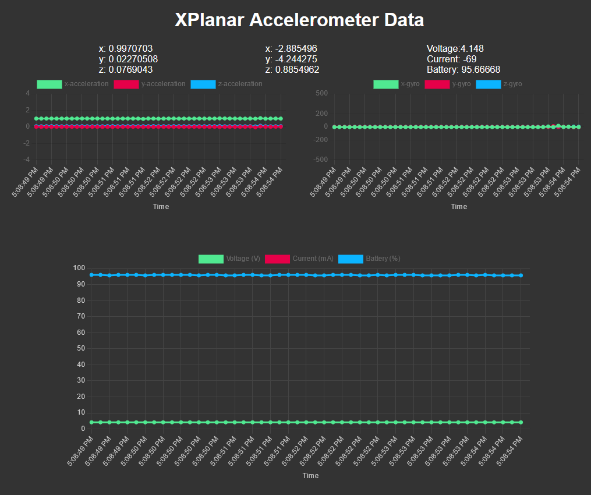

## Raspberry pi pico standalone aceceleration and gyro measurement

A simple setup that allows remote measurements of gyroscopic and acceleration values. The pico connects to a network and starts streaming data over websockets when the page is opened. The ip-address of the pico must be found (for example with `arp -a`). And then the page is accessible via `<ip-address>:5000`

The hardware is capable of running remotely due to the Waveshare Pico-UPS-B module with LiPO battery. Battery info is also shown in the web interface.

### Instructions
- Get the following hardware
    - Raspberry pi pico W
    - Waveshare UPS-B + LiPo battery
    - GY-521 sensor with MPU6050
    - Cables and/or solder necessary to make the required connections
- Build the circuit. The code assumes that certain pins are used, but these can freely be changed in some cases
    - SDA/SCL from the sensor board go to pins 20 and 21 on the pi
    - The communication from the UPS board is hardwired. You *could* change the I2C addresses by using the onboard resistors. But this is likely unnecessary.
- Download and install Thonny: https://thonny.org/
- Prepare the board with micropython (https://projects.raspberrypi.org/en/projects/get-started-pico-w/1)
- Install the following libraries to the board
    - microdot (V2.0.6)
    - ujson (V5.10.0)
    - umqtt (V1.3.4)
- Transfer the local python files to the board using thonny
    - MPU6050.py
    - UPSB.py
- Edit the `main.py` file to reflect your correct SSID and Password for the network.
- Copy the `index.html` file and the `main.py` file to the board.
- Disconnect the PI
- Switch the UPS board on (make sure the battery is charged)
- Navigate to `<ip>:5000`, the web page should show the live data from the board now.

### Todo
- Add MQTT data interface for more reliable data communication. This will also allow the data to be available directly in an external system.
- Expand web interface to allow start and stop of measurements.
- Expand web interface and code to allow switching measurement ranges.

### Sources

#### Used Libraries
- UPSB.py => https://www.waveshare.com/wiki/Pico-UPS-B
- MPU6050.py => https://timhanewich.medium.com/

#### Information
- https://projects.raspberrypi.org/en/projects/get-started-pico-w/3
- https://invensense.tdk.com/wp-content/uploads/2015/02/MPU-6000-Datasheet1.pdf
- https://pypi.org/project/microdot/
- https://www.hackster.io/517188/how-to-build-web-socket-on-raspberry-pi-pico-w-and-make-live-cbafe3
- https://www.raspberrypi-spy.co.uk/wp-content/uploads/2022/11/raspberry_pi_pico_w_pinout.png
- https://wokwi.com/projects/373176470515238913
- https://timhanewich.medium.com/how-to-use-an-mpu-6050-with-a-raspberry-pi-pico-using-micropython-cd768ea9268d
- https://core-electronics.com.au/guides/getting-started-with-mqtt-on-raspberry-pi-pico-w-connect-to-the-internet-of-things/
- https://projecthub.arduino.cc/Nicholas_N/how-to-use-the-accelerometer-gyroscope-gy-521-647e65